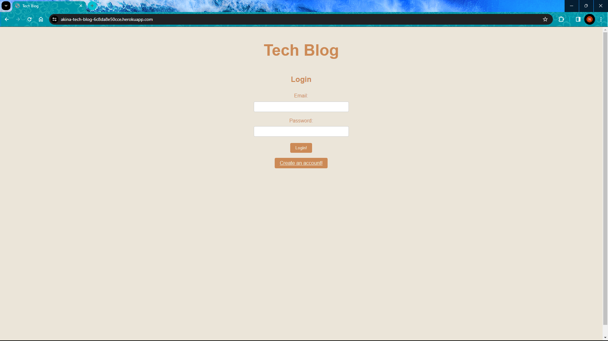
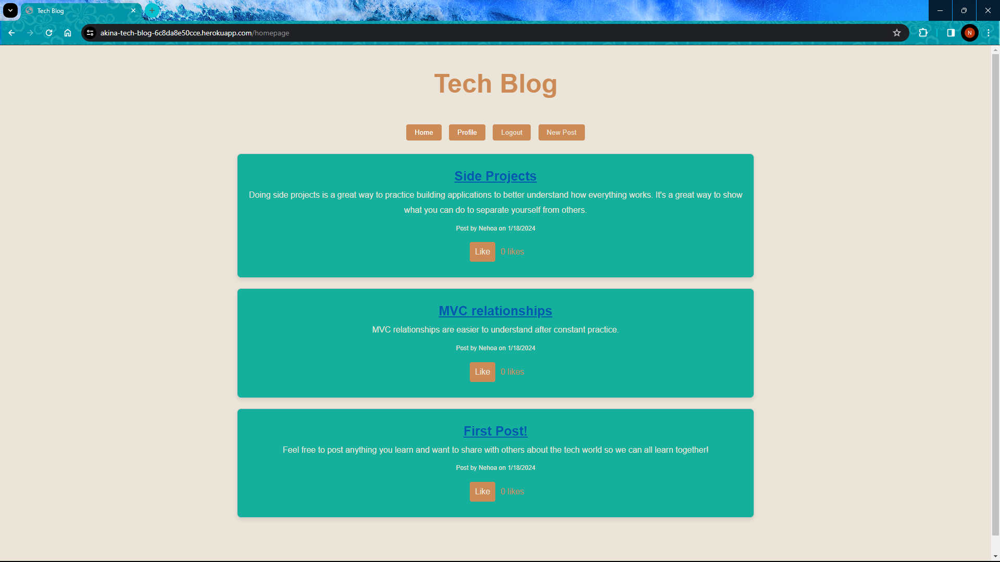

# MVC-Tech-Blog

## Description

This application is used as a mini social media where people can post/share what they learn about tech. Comments can be made for each post as well.

## Link

[Tech Blog](https://akina-tech-blog-6c8da8e50cce.herokuapp.com/)

## Table of Contents
  * [Installation](#installation)
  * [Usage](#usage)
  * [Contributing](#contributing)
  * [License](#license)
  * [Contact](#contact)
## Installation

1) Create an account by clicking `Create an account` and filling out info

## Usage

1) Navigate through the application: `Home`, `Profile`, `New Post`, `Logout`

## License

MIT License

## Contact

GitHub: [@Nehoa21](https://github.com/Nehoa21)

Email: nehoaakina21@yahoo.com

LinkedIn: 
